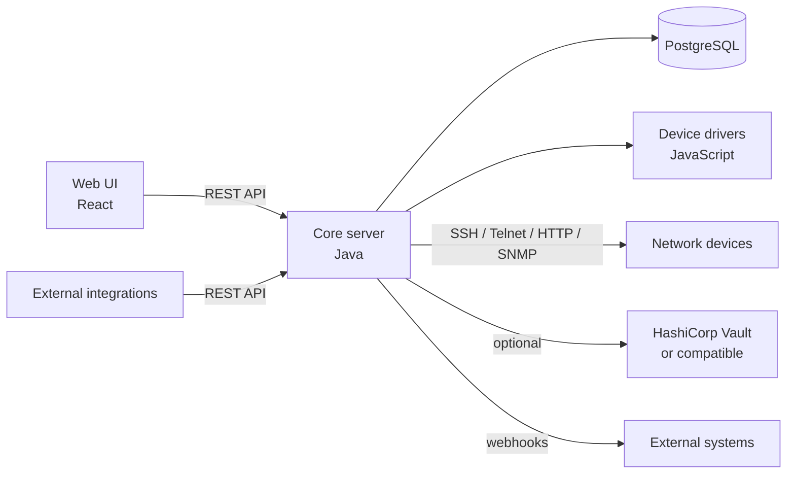

# Architecture

Netshot is a server application with a web front end. This page gives a map of its main components before you dive into installing, administering, or extending it.

## Overview

## Core server

The core server is a Java application. It is organized into a set of packages under `net.netshot.netshot`, each responsible for one concern:

- **`work`** — the task engine. `Task` and its subclasses (under `work.tasks`) represent scheduled or on-demand jobs — snapshots, scans, script runs, diagnostics — with support for hierarchical (parent/child) tasks. `MasterJob` drives execution on the cluster's elected master.
- **`device`** — the device model and connection handling: `Device`, `NetworkInterface`, `Module`, device groups (`StaticDeviceGroup`, `DynamicDeviceGroup`), and the `Finder` query engine behind device search. Sub-packages handle device network **`access`** (management addresses and per-access connection settings), **`credentials`** (CLI/HTTP/SNMP accounts, local or Vault-backed), **`attribute`** (custom device/config attributes), **`collector`** (pulling data off a live session), and **`script`** (running scripts against a device over SSH/Telnet/HTTP/SNMP).
- **`compliance`** — the rule engine: `Policy`, `Rule` and its subclasses (`SoftwareRule`, `HardwareRule`, plus config rules), `CheckResult`, and `Exemption`.
- **`diagnostic`** — diagnostic definitions (`SimpleDiagnostic`, `JavaScriptDiagnostic`, `PythonDiagnostic`) and their typed results (`DiagnosticTextResult`, `DiagnosticNumericResult`, `DiagnosticBinaryResult`, `DiagnosticLongTextResult`).
- **`aaa`** — authentication and authorization: local users (`User`, `UiUser`), API tokens (`ApiToken`), and the RADIUS, TACACS+, and OIDC (`Oidc`) integrations.
- **`cluster`** — high-availability support: `ClusterManager` and `ClusterMember` implement the master/runner election model described in [Clustering and High Availability](clustering-ha.md).
- **`vault`** — the optional HashiCorp Vault (or compatible) integration for externally-stored credentials: `VaultInstance`/`HashicorpVaultKv2Instance` for configured backends, `VaultClient` for the HTTP calls, `VaultManager` and `VaultTokenRefreshDaemon` for lifecycle/token-refresh, and `VaultableSecret`/`VaultKeyPath` for the fields on a device credential that can point at a Vault path instead of a locally-stored value. See [Vault instances](user-guide/administration.md#vault-instances).
- **`crypto`** — password hashing (`Argon2idHash`, `Sha2BasedHash`) and reversible encryption for stored secrets (`Sha2AesPasswordBasedEncryptor`).
- **`database`** — the persistence layer: Hibernate configuration, naming strategies, and the encrypted-column support (`StringEncryptorConverter`) used for secrets stored in the database.
- **`hooks`** — outbound webhooks: `Hook`, `WebHook`, and the `HookTrigger`s that fire them. See [Webhooks](api/webhooks.md).
- **`rest`** — the REST API layer (`RestService` and friends), which is the only way the Web UI talks to the core server, and is also available for external integrations. See [REST API](api/rest-api.md).

## Persistence

Netshot stores its inventory, configurations, compliance results, and settings in **PostgreSQL**, accessed through the `database` package. Device credential secrets are encrypted at rest by default, or can be delegated to an external Vault instance (see above).

## Device drivers

Support for a given device platform is implemented as a **JavaScript driver** — a single script file under `src/main/resources/drivers`, loaded (and reloadable at runtime) by the core server. Drivers declare how to connect to a device, what to collect (running/startup configuration, hardware/software versions, modules, interfaces...), and expose diagnostics and script hooks. See [Device drivers](user-guide/device-drivers.md) for the concept and [Writing a new driver](extending/writing-a-driver.md) to add support for a new platform.

## Web UI

The Web UI is a React single-page application, served by the core server and talking to it exclusively through the REST API. It provides the device inventory, compliance, diagnostics, reports, tasks, and administration screens described in the [user guide](user-guide/devices.md).

## REST API

Every action available in the Web UI — and more — is exposed over the REST API, which is also the supported way to integrate Netshot with external systems (CMDBs, automation pipelines, monitoring). See [REST API](api/rest-api.md).
